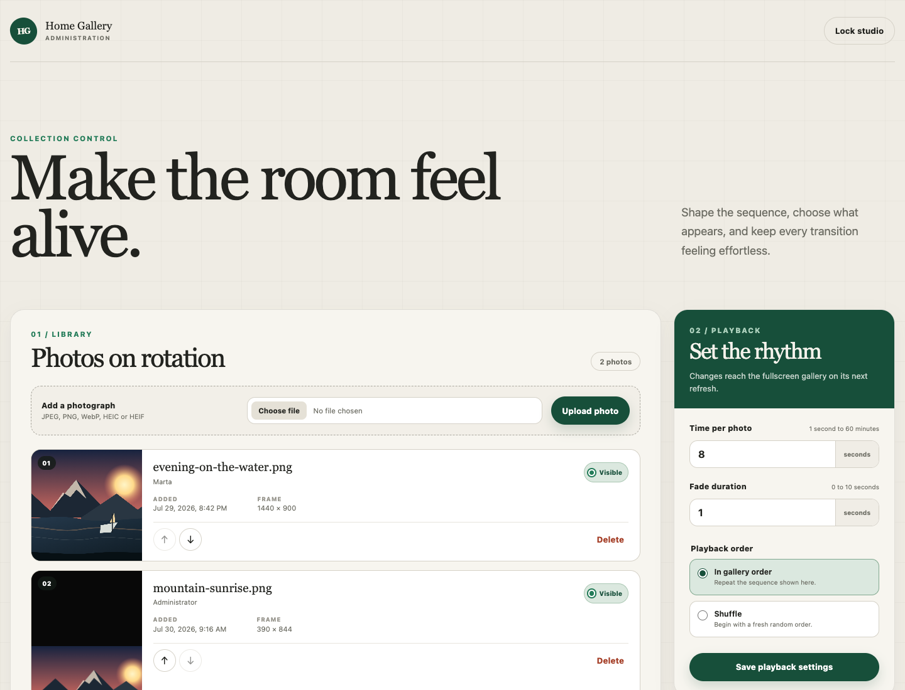

# Home Gallery

[](https://github.com/mateuszsikora/home-gallery/actions/workflows/ci.yml)

Self-hosted photo frame for your home: family and friends send photos to a Telegram bot, and the photos appear in a fullscreen browser slideshow on whatever screen you point at it. A separate administration app manages the library, the playback settings, and who is allowed to contribute.

Everything runs on your own hardware, on your own network. In the default profile the only service Home Gallery talks to at runtime is the Telegram Bot API; pulling the images needs GHCR, and the optional TLS profile adds an ACME provider.

## Where this came from

Home Gallery started as a screensaver for [Glance](https://github.com/mateuszsikora/glance), my Android kiosk for an always-on wall display — I wanted the screen showing the dashboard to fall back to family photos instead of going blank. That is why the gallery is its own bare URL at `/` with no navigation, no controls, and nothing to click: you open it in a kiosk or fullscreen tab and walk away. It then grew the parts a shared photo frame actually needs — a way for other people to add photos without touching the server, and a way for me to curate what ends up on the wall.

Note that the shipped images send `X-Frame-Options: DENY` and `frame-ancestors 'none'`, so the gallery is meant to be opened as its own tab or window rather than embedded in a dashboard iframe. Relaxing that is a deliberate change to `docker/web.conf`.

## How it works

```text
Telegram contributor
        │  photo message
        ▼
  Telegram bot  ──ingestion token──►  API server  ──►  SQLite + normalized media on disk
                                          │
                        ┌─────────────────┴─────────────────┐
                        ▼                                   ▼
              Fullscreen gallery                  Administration app
              (public playlist)                   (administration session)
```

A contributor writes to the bot. Their first message creates a pending access request and gets a status reply — nothing is downloaded until you approve them in the administration app. Once approved, the photos they send are downloaded by the bot, uploaded to the API, normalized, and added to the playlist. The source message is deleted from the Telegram chat only after storage is confirmed; a failed upload stays in the chat and gets a status reply, so it can be retried.

## Features

**Gallery**

- Fullscreen, unattended playback that needs no interaction and no input device.
- Portrait and landscape photos without forced cropping. Three fit modes: blurred backdrop, crop-when-the-loss-is-small, or plain black bars.
- Configurable time per photo (1 second to 60 minutes) and crossfade duration.
- Sequential or shuffled order.
- Preloads upcoming images, refreshes the playlist every 30 seconds, and keeps showing the last usable playlist while the API is unreachable.

**Administration**

- Reorder, hide, or delete photos; hidden photos stay in the library but leave the rotation.
- Approve or reject Telegram contributors from the browser — no redeploy, no restart, no user IDs in config files.
- Change playback settings live; the gallery picks them up on its next refresh.
- Set, change, or remove the administration password from the app itself; no administration credential lives in `.env` or needs a redeploy.

**Ingestion**

- Telegram photo messages and JPEG, PNG, WebP, HEIC, and HEIF image documents.
- Server-side content verification, size and decoded-pixel limits, EXIF orientation handling, and normalization to a browser-friendly format.
- Optional direct upload from the administration app, off by default behind `HOME_GALLERY_ALLOW_ADMIN_UPLOADS`.



The upload control visible in the screenshot is always rendered, but the server rejects browser uploads unless `HOME_GALLERY_ALLOW_ADMIN_UPLOADS=true`. The administration app [reflows for narrow screens](docs/screenshots/admin-narrow.png), and [the gallery on a portrait screen](docs/screenshots/gallery-narrow.png) shows the blurred-edges fit mode filling the space a landscape photo leaves behind.

## Quick start with Docker Compose

You need Docker Engine with Compose v2, and a bot token from [BotFather](https://t.me/BotFather).

```bash
git clone https://github.com/mateuszsikora/home-gallery.git
cd home-gallery
cp .env.example .env
chmod 600 .env
```

Replace every placeholder in `.env`. At minimum:

```bash
# The ingestion credential, at least 32 characters:
openssl rand -hex 32   # HOME_GALLERY_INGESTION_TOKEN
# And the token BotFather gave you:
#   HOME_GALLERY_TELEGRAM_BOT_TOKEN
```

Administration access is not configured here — you set the password from the app itself on first run.

Then start the stack:

```bash
bash infra/deploy.sh
```

`deploy.sh` is the supported path: it validates `.env`, requires mode `600`, pins the Compose project name to `home-gallery`, pulls the configured image tag, and waits for the health checks. The images are public GHCR packages, so no registry login is needed.

The underlying command for the default profile, if you prefer to see it spelled out:

```bash
docker compose --project-name home-gallery --env-file .env up -d --wait
```

Keep `--project-name home-gallery` either way. `infra/backup.sh` and `infra/restore.sh` refuse to operate on any other project name, and without the flag Compose derives the name from the directory — which silently breaks backup and restore in a fork, a ZIP download, or any directory not named `home-gallery`. Add `--build` to build from source instead of pulling.

That command is not a substitute for `deploy.sh` once `HOME_GALLERY_TLS_ENABLED=true`: the script also adds `docker-compose.tls.yml` and the `caddy` service, and refuses to continue unless `HOME_GALLERY_HTTP_BIND_ADDRESS=127.0.0.1`. Run the raw command against a TLS `.env` and you get the three plain-HTTP services bound to loopback with no proxy in front — nothing reachable, and no error saying so. Deploy TLS through `deploy.sh`.

Home Gallery stays isolated from anything else on the host: its own Compose project, configuration, secrets, ports, containers, network, and data volume. It never joins another project's network, mounts its volumes, addresses its containers, or runs `--remove-orphans`. The default ports avoid the crowded `3000`–`3003` range for the same reason.

| Service        | Default URL        |
| -------------- | ------------------ |
| Gallery        | `http://HOST:3010` |
| Administration | `http://HOST:3011` |
| API            | `http://HOST:3012` |

Now open the administration app. **A fresh installation has no administration password** — it opens for anyone who can reach it, and says so on the sign-in screen and in a banner at the top of the app, until you set one from its **Security** panel. Do that first. Then approve your first contributor after they write to the bot, point a browser at the gallery URL in kiosk or fullscreen mode, and leave it there.

Backup, restore, rollback, host-port changes, and the optional TLS profile are covered in [docs/DEPLOYMENT.md](docs/DEPLOYMENT.md).

## Security posture

The default profile serves plain HTTP and is meant for a trusted LAN or an authenticated private overlay network — not the public internet.

**A new installation starts with the administration app unprotected.** There is no password in `.env` and no default password to look up; the app is open to anyone who can reach port 3011 until an administrator sets one from the **Security** panel. That is a deliberate trade for a first-run experience on a trusted LAN, and it means the gallery should not be reachable from anywhere else until you have set the password. Passwords are 8 to 128 characters and are taken verbatim, including leading and trailing spaces, so whatever a password manager generated is what you can type back. Control characters are rejected because they cannot be retyped, and the value is NFC-normalized before hashing so equivalent Unicode input still matches.

**Upgrading an installation that predates the password also leaves the app unprotected.** The release that removed `HOME_GALLERY_ADMIN_TOKEN` did not migrate it into a password: a panel that was credential-protected before the upgrade is open to the network afterwards, and the only runtime signal is a `warn` line in the server log. Set a password immediately after upgrading and drop the dead token lines from `.env` — see [Upgrade and rollback](docs/DEPLOYMENT.md#upgrade-and-rollback).

Setting, changing, or removing the password signs out every other browser and keeps the one making the change signed in.

Administration and ingestion are separate: the Telegram bot holds only `HOME_GALLERY_INGESTION_TOKEN` and cannot reach administration routes. Browser sessions exchange the password for an opaque `HttpOnly`, `SameSite=Strict` cookie held only in server memory, with an explicit anti-CSRF header on mutations and an eight-hour expiry. The password is never put in browser storage or a URL, is stored only as a salted scrypt hash, is never logged or returned by the API, and a rejected attempt consumes the same bounded authentication rate limit as any other failed credential. A server restart invalidates every session.

Because the password hash lives in the gallery database rather than in the deployment configuration, a forgotten password is recovered by clearing its row on the host — see [Recovering a forgotten administration password](docs/DEPLOYMENT.md#recovering-a-forgotten-administration-password).

For public exposure, use the supported TLS profile in [docs/DEPLOYMENT.md](docs/DEPLOYMENT.md), which puts Caddy in front and binds the plain-HTTP ports to loopback. The threat model and reporting process are in [SECURITY.md](SECURITY.md); the security review record is in [docs/VALIDATION.md](docs/VALIDATION.md).

## Local development

Requires Node.js 26 and the bundled npm. From a clean checkout:

```bash
npm ci
npm run check
```

`npm run check` runs the CI sequence: `format:check`, `lint`, `typecheck`, `test`, `build`. Individual commands are `npm run format`, `npm run lint`, `npm run typecheck`, `npm test`, `npm run test:watch`, and `npm run build`.

The API server reads its configuration from the environment and refuses to start when a security-critical variable is missing or invalid:

```bash
npm run build
HOME_GALLERY_INGESTION_TOKEN="$(openssl rand -hex 32)" \
HOME_GALLERY_DATA_DIR=./data \
npm run start --workspace @home-gallery/server
```

`GET http://localhost:3012/health` then reports process state. The data directory holds the SQLite database and the normalized media, is created on first start, and must be a persistent volume in production.

With the server running, start either frontend:

```bash
# Gallery
VITE_HOME_GALLERY_API_URL=http://localhost:3012 \
npm run dev --workspace @home-gallery/frontend -- --port 3010

# Administration
VITE_HOME_GALLERY_API_URL=http://localhost:3012 \
npm run dev --workspace @home-gallery/admin -- --port 3011
```

`VITE_HOME_GALLERY_API_URL` defaults to the page origin when omitted, which is what production uses behind the bundled reverse proxy. In development the two frontends are on different origins than the API, so list them in `HOME_GALLERY_ALLOWED_ORIGINS` when starting the server — for the commands above, `HOME_GALLERY_ALLOWED_ORIGINS=http://localhost:3010,http://localhost:3011`. Neither Vite config pins a port, so pass `--port` explicitly; otherwise they land on Vite's default and the API rejects their requests.

And the bot:

```bash
HOME_GALLERY_TELEGRAM_BOT_TOKEN="<bot-token>" \
HOME_GALLERY_API_URL=http://localhost:3012 \
HOME_GALLERY_INGESTION_TOKEN="<server-ingestion-token>" \
npm run start --workspace @home-gallery/telegram-bot
```

Keep `HOME_GALLERY_TELEGRAM_MAX_DOWNLOAD_BYTES` at or below the server's `HOME_GALLERY_MAX_UPLOAD_BYTES` so oversized responses are rejected before they are buffered for upload.

`npm run test:compose` exercises upload, restart persistence, backup, and restore in a disposable Compose project.

## Repository layout

An npm-workspaces TypeScript monorepo:

| Path                                | Contents                                                   |
| ----------------------------------- | ---------------------------------------------------------- |
| `apps/server`                       | Fastify API, SQLite, media normalization and storage       |
| `apps/frontend`                     | React fullscreen gallery                                   |
| `apps/admin`                        | React administration app                                   |
| `apps/telegram-bot`                 | Telegram ingestion bot                                     |
| `packages/`                         | `api-client`, `config`, `shared-types`                     |
| `infra/`                            | `deploy.sh`, `backup.sh`, `restore.sh`                     |
| `docker/`                           | nginx and Caddy configuration for the web containers       |
| `scripts/`                          | Compose and TLS smoke tests                                |
| `Dockerfile`, `docker-compose*.yml` | Multi-target image build and the Compose stack             |
| `docs/`                             | Specification, plan, API contracts, deployment, validation |

Each application is independently deployable and talks only through public APIs or shared contracts.

## Documentation

- [docs/SPECIFICATION.md](docs/SPECIFICATION.md) — product requirements
- [docs/API.md](docs/API.md) — HTTP routes and payloads
- [docs/DEPLOYMENT.md](docs/DEPLOYMENT.md) — production deployment, backup, restore, rollback, TLS
- [docs/VALIDATION.md](docs/VALIDATION.md) — MVP evidence and security review
- [docs/IMPLEMENTATION_PLAN.md](docs/IMPLEMENTATION_PLAN.md) — delivery sequence
- [docs/AGENT_WORKFLOW.md](docs/AGENT_WORKFLOW.md) — how the project is built

## How this project is built

Home Gallery is developed by coding agents, one GitHub issue per pull request. A new session needs only this prompt:

> Read the Markdown files and continue the project.

[AGENTS.md](AGENTS.md) tells the agent how to pick a ready issue, implement it, validate it, and open a pull request. The backlog is the [GitHub issue list](https://github.com/mateuszsikora/home-gallery/issues).

## Status and contributing

This is a personal project, published so others can read, fork, and adapt it. It is maintained on a best-effort basis: issues and pull requests are welcome, but there is no support commitment and no release schedule. Run it on a trusted network and read [docs/VALIDATION.md](docs/VALIDATION.md) before exposing it more widely.

## License

[MIT](LICENSE)
